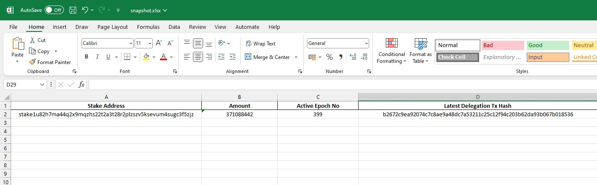

#SnapshotRandomDelegators
-------------------

[SnapshotRandomDelegators] is a script to take a snapshot of random delegators in your stake pools. Sample using BERRY Stake Pool.
-------------------

Output Sample

How to run ?
-------------------
- git clone `https://github.com/deadrepo/SnapshotRandomDelegators.git`
- pip install -r `requirements.txt`
- python3 `main.py`

API Endpoints
-------------------
- Data from [Koios](https://api.koios.rest/api/v0/pool_delegators?_pool_bech32=pool19f6guwy97mmnxg9dz65rxyj8hq07qxud886hamyu4fgfz7dj9gl)
  
Info
-------------------
- [CEXplorer](https://cexplorer.io/pool/pool19f6guwy97mmnxg9dz65rxyj8hq07qxud886hamyu4fgfz7dj9gl)
- You can change the endpoints by changing the _pool_bech32=
- You can get the _pool_bech32 at CEXplorer or Cardanoscan

Made by [deadrepo]
-------------------

(づ ◕‿◕ )づ
